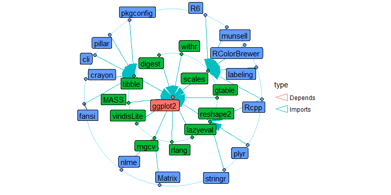

# deepdep 

<!-- badges: start -->

[](https://www.tidyverse.org/lifecycle/#maturing)
[](https://codecov.io/gh/DominikRafacz/deepdep?branch=master)
[](https://travis-ci.org/DominikRafacz/deepdep)
[](https://circleci.com/gh/DominikRafacz/deepdep)
[](https://ci.appveyor.com/project/DominikRafacz/deepdep)

<!-- badges: end -->

Acquire and Visualise Deep Dependiences of R packages.

## Installation

``` r
# Install the development version from GitHub:
devtools::install_github("DominikRafacz/deepdep")
```

## Demo

``` r
library(deepdep)

dd1 <- deepdep("ggplot2", downloads = TRUE)

head(dd1)
```

    ##    origin     name  version    type last_day last_week last_month
    ## 1 ggplot2   digest     <NA> Imports    33628    220886    1016882
    ## 2 ggplot2   gtable >= 0.1.1 Imports    17972    118317     505575
    ## 3 ggplot2 lazyeval     <NA> Imports    21899    139851     617251
    ## 4 ggplot2     MASS     <NA> Imports     5046     32509     128859
    ## 5 ggplot2     mgcv     <NA> Imports     8502     48164     171209
    ## 6 ggplot2 reshape2     <NA> Imports    31767    158810     682173
    ##   last_quarter last_half grand_total
    ## 1      2709067   4667194    21943008
    ## 2      1486543   2677447    14220311
    ## 3      1770373   3061854    15000128
    ## 4       346953    694407     5355621
    ## 5       363180    565222     4396963
    ## 6      1924473   3243632    17543856

``` r
plot_dependencies(dd1, "tree")
```

<!-- -->

``` r
dd2 <- deepdep("ggplot2", depth = 2)

plot_dependencies(dd2, "circular")
```

<!-- -->

-----

This package was made during `1120-DS000-ISP-0500`[Advanced Programming
in R](https://github.com/mini-pw/2020Z-ProgramowanieWR) course at Warsaw
University of Technology.
