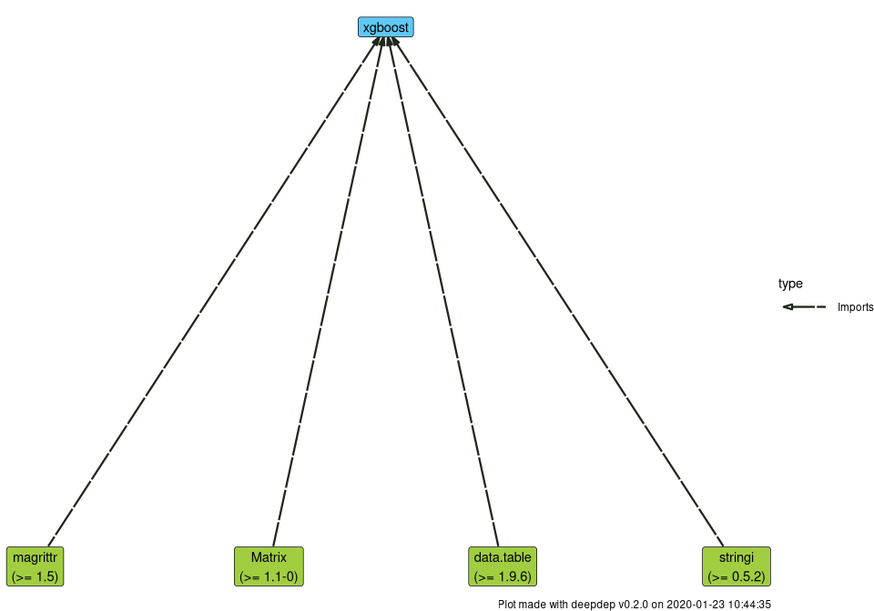

# deepdep 

<!-- badges: start -->

[](https://travis-ci.org/DominikRafacz/deepdep)
[](https://circleci.com/gh/DominikRafacz/deepdep)
[](https://ci.appveyor.com/project/DominikRafacz/deepdep)
[](https://codecov.io/gh/DominikRafacz/deepdep?branch=master)
[](https://www.tidyverse.org/lifecycle/#maturing)

<!-- badges: end -->

Visualise and Explore Deep Dependencies of R packages.

The `deepdep` package provides the tools for exploration of package
dependencies. Main `deepdep()` function allows to acquire deep
dependencies of any package and plot them in an elegant way. It also
adds some popularity measures for the packages e.g. in the form of
download count through the cranlogs package. Uses the CRAN metadata
database (<http://crandb.r-pkg.org>) and Bioconductor metadata
(<http://bioconductor.org>). Other data acquire functions are:
`get_dependencies()`, `get_downloads()` and `get_description()`. The
`deepdep_shiny()` function runs shiny application that helps to produce
nice **deepdep plot**.

[Cheatsheet](https://dominikrafacz.github.io/deepdep/articles/deepdep-package.html)

## Installation

``` r
# Install from CRAN: 
install.packages("deepdep")

# Install the development version from GitHub:
devtools::install_github("DominikRafacz/deepdep")
```

## Demo

``` r
library(deepdep)

dd <- deepdep("ggplot2", depth = 2)

head(dd)
```

    ##    origin     name  version    type
    ## 1 ggplot2   digest     <NA> Imports
    ## 2 ggplot2   gtable >= 0.1.1 Imports
    ## 3 ggplot2 lazyeval     <NA> Imports
    ## 4 ggplot2     MASS     <NA> Imports
    ## 5 ggplot2     mgcv     <NA> Imports
    ## 6 ggplot2 reshape2     <NA> Imports

``` r
plot_dependencies(dd, "circular")
```


``` r
plot_dependencies("bayes4psy", show_version = TRUE,
                  dependency_type = c("Depends", "Imports", "Suggests", "LinkingTo"))
```


``` r
dd_xgboost <- deepdep("xgboost", dependency_type = "Imports", downloads = TRUE)

head(dd_xgboost)
```

    ##    origin       name  version    type last_day last_week last_month last_quarter last_half grand_total
    ## 1 xgboost     Matrix >= 1.1-0 Imports     3729     20400      74187       287040    513665     4523288
    ## 2 xgboost data.table >= 1.9.6 Imports    23449    125406     429207      1604630   3224335    15752898
    ## 3 xgboost   magrittr   >= 1.5 Imports   150007    951942    4136796     11948739  21800198    39826592
    ## 4 xgboost    stringi >= 0.5.2 Imports    40188    224331     703439      2134561   4101211    23118972

``` r
plot_downloads(dd_xgboost)
```


``` r
plot_dependencies(dd_xgboost, "tree", show_version = TRUE)
```


<!------------------------

This package was made during `1120-DS000-ISP-0500`[Advanced Programming in R](https://github.com/mini-pw/2020Z-ProgramowanieWR) course at Warsaw University of Technology.-->
