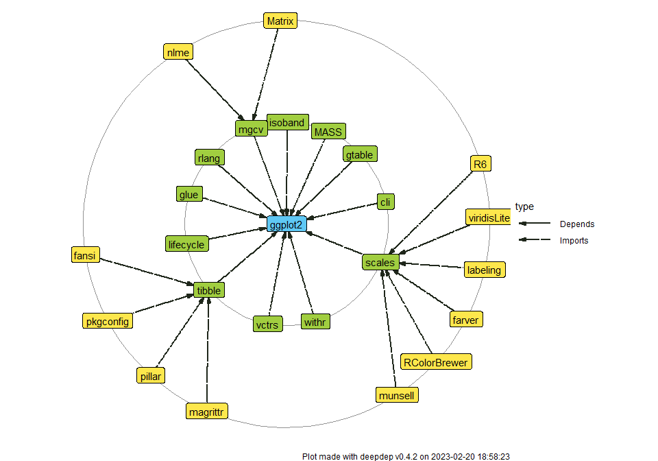

# deepdep 

<!-- badges: start -->

[](https://travis-ci.org/DominikRafacz/deepdep)
[](https://circleci.com/gh/DominikRafacz/deepdep)
[](https://ci.appveyor.com/project/DominikRafacz/deepdep)
[](https://codecov.io/gh/DominikRafacz/deepdep?branch=master)
[](https://www.tidyverse.org/lifecycle/#maturing)

<!-- badges: end -->

Acquire and Visualise Deep Dependiences of R packages.

[Cheatsheet](https://github.com/DominikRafacz/deepdep/blob/master/images/cheatsheet.pdf)

## Installation

``` r
# Install the development version from GitHub:
devtools::install_github("DominikRafacz/deepdep")
```

## Demo

``` r
library(deepdep)

dd1 <- deepdep("ggplot2", downloads = TRUE)

head(dd1)
```

    ##    origin     name  version    type last_day last_week last_month last_quarter last_half grand_total
    ## 1 ggplot2   digest     <NA> Imports    28386    197307     642119      2540192   4934872    23738239
    ## 2 ggplot2   gtable >= 0.1.1 Imports    15395    103453     319982      1284442   2669634    15152569
    ## 3 ggplot2 lazyeval     <NA> Imports    19591    135910     475254      1739141   3375715    16307093
    ## 4 ggplot2     MASS     <NA> Imports     5362     35342     128418       379084    705599     5642553
    ## 5 ggplot2     mgcv     <NA> Imports     2449     16403      57414       347689    617739     4609430
    ## 6 ggplot2 reshape2     <NA> Imports    20973    145371     488143      1785842   3530723    18852059

``` r
plot_dependencies(dd1, "tree", show_downloads = TRUE)
```



``` r
dd2 <- deepdep("ggplot2", depth = 2)

plot_dependencies(dd2, "circular")
```


``` r
plot_dependencies("bayes4psy", show_version = TRUE, dependency_type = c("Depends", "Imports", "Suggests", "LinkingTo"))
```


-----

This package was made during `1120-DS000-ISP-0500`[Advanced Programming
in R](https://github.com/mini-pw/2020Z-ProgramowanieWR) course at Warsaw
University of Technology.
