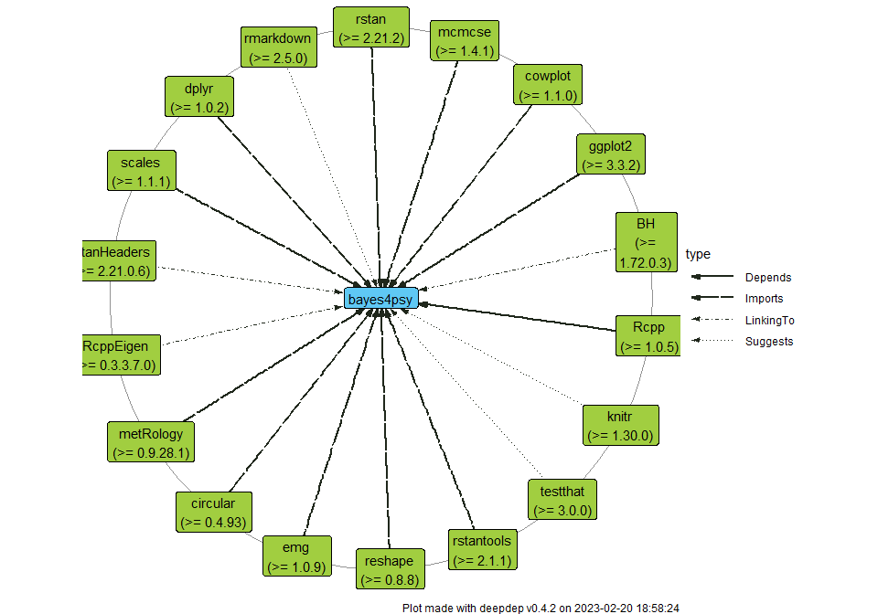
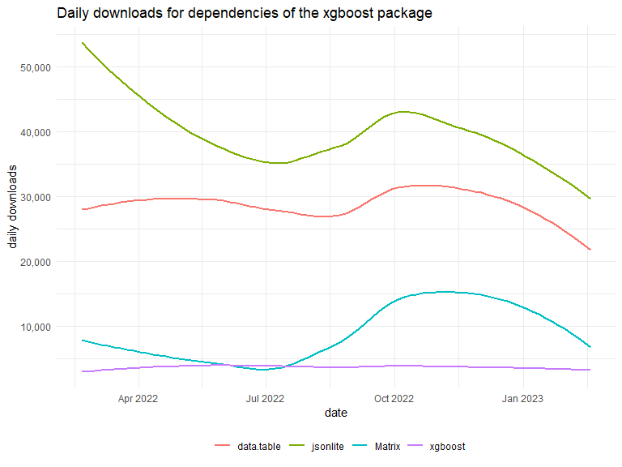

# Visualise and Explore Deep Dependencies of R Packages 

<!-- badges: start -->

[](https://CRAN.R-project.org/package=deepdep)
[](https://circleci.com/gh/DominikRafacz/deepdep)
[](https://ci.appveyor.com/project/DominikRafacz/deepdep)
[](https://codecov.io/gh/DominikRafacz/deepdep?branch=master)
[](https://www.tidyverse.org/lifecycle/#maturing)

<!-- badges: end -->

## Overview

The `deepdep` package provides tools for exploration of package
dependencies. The main `deepdep()` function allows to acquire deep
dependencies of any package and plot them in an elegant way. It also
adds some popularity measures for the packages e.g. in the form of
download count through the `cranlogs` package. Uses the [CRAN metadata
database](http://crandb.r-pkg.org) and [Bioconductor
metadata](http://bioconductor.org).

**Exploration tools:**

-   `deepdep()`
-   `get_dependencies()`
-   `get_downloads()`
-   `get_description()`

**Visualisation tools:**

-   `plot_dependencies()`
-   `plot_downloads()`
-   `deepdep_shiny()` runs shiny application that helps to produce a
    nice **deepdep plot**

## Installation

``` r
# Install from CRAN: 
install.packages("deepdep")

# Install the development version from GitHub:
devtools::install_github("DominikRafacz/deepdep")
```

## Examples [**introduction to the deepdep package**](https://dominikrafacz.github.io/deepdep/articles/deepdep-package.html)

``` r
library(deepdep)

dd <- deepdep("ggplot2", depth = 2)

head(dd)
```

    ##    origin    name  version    type origin_level dest_level
    ## 1 ggplot2  digest     <NA> Imports            0          1
    ## 2 ggplot2    glue     <NA> Imports            0          1
    ## 3 ggplot2  gtable >= 0.1.1 Imports            0          1
    ## 4 ggplot2 isoband     <NA> Imports            0          1
    ## 5 ggplot2    MASS     <NA> Imports            0          1
    ## 6 ggplot2    mgcv     <NA> Imports            0          1

``` r
plot_dependencies(dd, "circular")
```


``` r
plot_dependencies("bayes4psy", show_version = TRUE,
                  dependency_type = c("Depends", "Imports", "Suggests", "LinkingTo"))
```



``` r
dd_xgboost <- deepdep("xgboost", dependency_type = "Imports", downloads = TRUE)

head(dd_xgboost)
```

    ##    origin       name  version    type last_day last_week last_month last_quarter last_half grand_total origin_level dest_level
    ## 1 xgboost     Matrix >= 1.1-0 Imports     4962     49063     201226       599306   1098929     7800163            0          1
    ## 2 xgboost data.table >= 1.9.6 Imports    40960    234207     944126      2698034   5087085    35644069            0          1
    ## 3 xgboost   jsonlite   >= 1.0 Imports    47616    292658    1133042      4233587   7327155    58000689            0          1

``` r
plot_downloads(dd_xgboost)
```



``` r
plot_dependencies(dd_xgboost, "tree", show_version = TRUE)
```


<!------------------------

This package was made during `1120-DS000-ISP-0500`[Advanced Programming in R](https://github.com/mini-pw/2020Z-ProgramowanieWR) course at Warsaw University of Technology.-->
