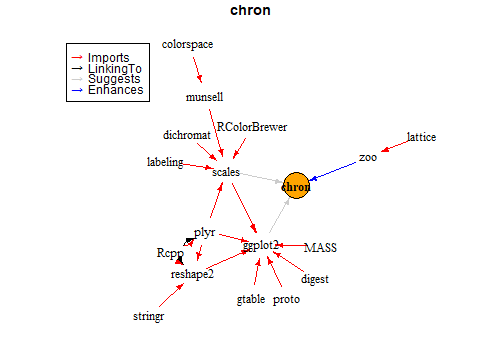

# Comparison to other packages

There are a few already existing solutions to the problem of visualizing dependencies. In this last section, we will compare `deepdep` to those solutions.

This solutions are (with links to their GitHub repositories):

* [datastorm-open/DependenciesGraphs](https://github.com/datastorm-open/DependenciesGraphs)
* [uptake/pkgnet](https://github.com/uptake/pkgnet)
* [andrie/miniCRAN](https://github.com/andrie/miniCRAN)
* [Bioconductor/pkgDepTools](https://github.com/Bioconductor/pkgDepTools)

# General advantages of deepdep

First and foremost, our package is the only one that uses `ggplot2` and its enhancements, which is currently the most popular way of visualizing anything in R. You can easily modify plots generated with our package.

Secondly, we are trying to keep plots clear and tidy. We're rather showing general structure of dependencies, their density and also show, which of the dependencies are the most crucial.

At last, `deepdep` function is able to show levels of dependencies, which is not true for other packages listed here -- they either show only first-level dependencies or all possible dependencies

---

In the following sections we'll describe why our package is better in some aspects than others, but also features that we're lacking.

# DependenciesGraphs

This package allows creating interactive graphs (using `visNetwork`) to visualize dependencies between packages and also between functions in those packages.

### Advantages:

* Interactivity is a great feature.
* Possibility of visualizing dependencies between functions.
* You can add multiple packages instead of one.
* Returned object is kept in a quite popular and easily modifiable format.
* You can run shiny app with the result.

### Disadvantages:

* You have to have installed the package you want to visualize. It is not a great issue, because mostly you visualize your own packages, but if you would like to create some bigger example, including a lot of packages you haven't installed, it may make a problem.
* Graph can get very messy easily and there is no built-in options to prevent it.
* There is no differentiation between levels of dependencies.
* It is available only on GitHub


```r
#> an example from the website on github.io
library(devtools, quietly = TRUE)
install_github("datastorm-open/DependenciesGraphs")
library(DependenciesGraphs, quietly = TRUE)

# you mus first loaded the target package using library
library(plyr,quietly = TRUE)

dep <- Pck.load.to.vis("plyr")
plot(dep)

```

# pkgnet

Tool for obtaining information on specified package, especially plotting network of package and function dependencies.

### Advantages
* It has a fantastic function to automatically generating whole report or vignette on one package.
* Interactive graphs -- again using `visNetwork`.
* It is very convenient and verbose...

### Disadvantages
* ...maybe even too much. Sometimes you don't need as much data.
* You cannot do it with small steps -- you get all information at once, if you want only one specific thing, you need to dig through a lot of other informations.
* You have to install the package to get info on it.


```r
#> opens a report
library(pkgnet)
result <- CreatePackageReport('ggplot2')

```
# miniCRAN
From README.md on Github:

> The **miniCRAN** package makes it possible to create an internally consistent repository consisting of selected packages from CRAN-like repositories. The user specifies a set of desired packages, and miniCRAN recursively reads the dependency tree for these packages, then downloads only this subset.

### Advantages:
* You can create local repositories and modify them.
* You have wider selection of repositories to choose from.
* Graph in an igraph.
* You can visualize multiple packages at once.

### Disadvantages:
* No built-in package support for other plots than base. Which are not very pretty.


```r
#> an example from official vignette
library(miniCRAN, quietly = TRUE)

tags <- "chron"
pkgDep(tags, availPkgs = cranJuly2014)
#>  [1] "chron"        "RColorBrewer" "dichromat"    "munsell"      "plyr"        
#>  [6] "labeling"     "colorspace"   "Rcpp"         "digest"       "gtable"      
#> [11] "reshape2"     "scales"       "proto"        "MASS"         "stringr"     
#> [16] "ggplot2"

dg <- makeDepGraph(tags, enhances = TRUE, availPkgs = cranJuly2014)
set.seed(1)
plot(dg, legendPosition = c(-1, 1), vertex.size = 20)
```


# pkgDepTools

Description from official vignette:

> The **pkgDepTools** package provides tools for computing and
analysing dependency relationships among R packages.  With it, you can
build a graph-based representation of the dependencies among all
packages in a list of CRAN-style package repositories.  There are
utilities for computing installation order of a given package and, if
the RCurl package is available, estimating the download size required
to install a given package and its dependencies.

### Advantages:
* You can pass URL of any repositories, on the contrary to our function, which allows only CRAN, Bioconductor or locally installed packages, but as other repositories are not as commonly used.

### Disadvantages:
* There is no possibility of downloading only a part of the packages. Each time you have to wait for the whole repository to be downloaded.
* You cannot choose type of dependencies "Enhances".
* Storage format is `graphNEL` -- not very commonly used and thus not so obvious to modify or adjust.
* This package is pretty outdated. It was created when R was not so popular (and its repositories were quite small) and not modified much since then.


```r
#> code not evaluated due to very long execution time
library(pkgDepTools)
library(Rgraphviz)
graph <- makeDepGraph("http://cran.fhcrc.org", type="source")
plot(graph)
```
