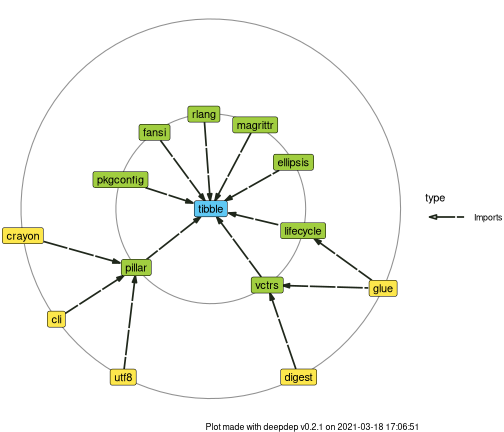
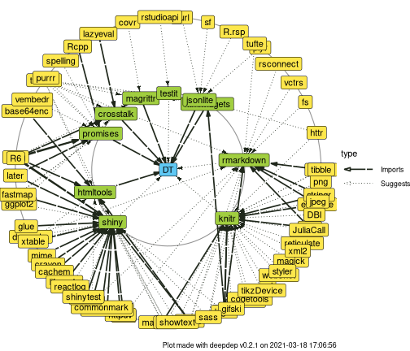
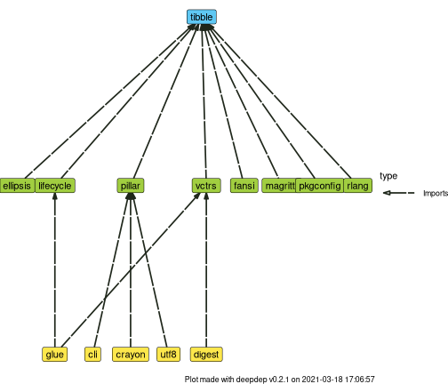
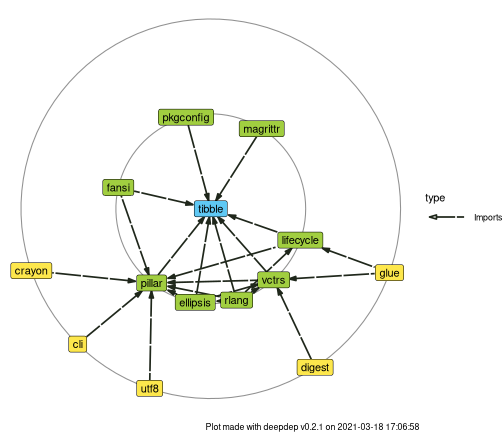
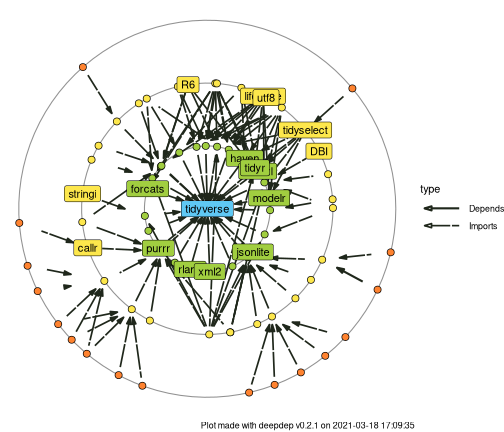
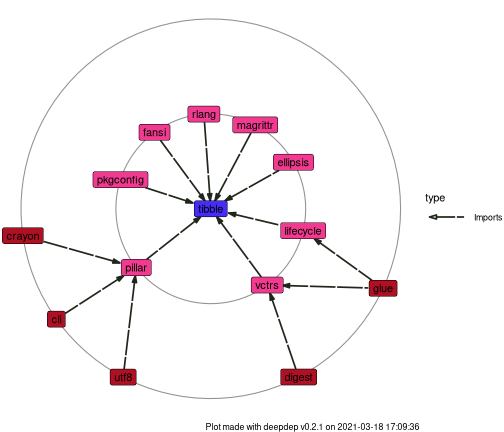

# Introduction

Package `deepdep` was created to acquire and visualize information on dependencies of R packages in a smart and convenient way. Most of its functionality is contained in two functions: `deepdep` -- to get a `data.frame` with dependencies described and `plot_dependencies` -- visualize this `data.frame`.


```r
library(deepdep)
```

## Use case

Suppose you're creating an R package and you want to include graph of its dependencies to your vignette, `README.md` file on your git repository or article on your package. With `deepdep` you simply need to type one line:


```r
plot_deepdep("YourPackageName")
```

But before we describe how this function works in detail, let's see what are other functionalities of the package.

# Features

`deepdep` package exports the following functions:

* `get_available_packages`,
* `get_description`,
* `get_dependencies`,
* `get_downloads`,
* `deepdep`,
* `plot_dependencies`.

Those functions rely on each other and are ordered from the lowest to the highest level.
We'll describe what they exactly do and how on examples.

## get_available_packages

This function lists, as the name indicates, available packages. The default behaviour is listing all CRAN packages.


```r
t <- get_available_packages()
head(t, 20)
#>            A3         aaSEA      AATtools        ABACUS        abbyyR 
#>          "A3"       "aaSEA"    "AATtools"      "ABACUS"      "abbyyR" 
#>           abc      abc.data       ABC.RAP        abcADM   ABCanalysis 
#>         "abc"    "abc.data"     "ABC.RAP"      "abcADM" "ABCanalysis" 
#>      abcdeFBA      ABCoptim         ABCp2         abcrf       abcrlda 
#>    "abcdeFBA"    "ABCoptim"       "ABCp2"       "abcrf"     "abcrlda" 
#>      abctools           abd         abdiv           abe          abf2 
#>    "abctools"         "abd"       "abdiv"         "abe"        "abf2"
```

However, if you want to check if package is present in a little wider range -- on CRAN or Bioconductor repositories, you simply need to set argument `bioc = TRUE`. In this case function is simply wrapper around `BiocManager::available()` and to use it you need to have `BiocManager` package (available via CRAN) installed.


```r
t <- get_available_packages(bioc = TRUE)
head(t, 20)
#>  [1] "A3"            "a4"            "a4Base"        "a4Classif"    
#>  [5] "a4Core"        "a4Preproc"     "a4Reporting"   "aaSEA"        
#>  [9] "AATtools"      "ABACUS"        "ABAData"       "ABAEnrichment"
#> [13] "ABarray"       "abbyyR"        "abc"           "abc.data"     
#> [17] "ABC.RAP"       "abcADM"        "ABCanalysis"   "abcdeFBA"
```

Another possibility is checking what packages are installed -- you do it by adding `local = TRUE` parameter.


```r
t <- get_available_packages(local = TRUE)
head(t, 20)
#>  [1] "abind"                    "acepack"                 
#>  [3] "ade4"                     "AmpGram"                 
#>  [5] "AmpGramModel"             "AmyloGram"               
#>  [7] "AnnotationDbi"            "AnotherRandomRcppProject"
#>  [9] "ape"                      "arrangements"            
#> [11] "askpass"                  "assertthat"              
#> [13] "auprc"                    "backports"               
#> [15] "base64enc"                "base64url"               
#> [17] "bazar"                    "BBmisc"                  
#> [19] "bbotk"                    "berryFunctions"
```

Result of this function is cached (for more details, see *Caching* section of this vignette).

## get_description

When you know, that given package is available, you may want to obtain DESCRIPTION of this package, at least the most essential parts of it, especially dependencies. You can do it by calling:


```r
get_description("DALEXtra")
#> DALEXtra: Extension for 'DALEX' Package
#> Maintainer: Szymon Maksymiuk <sz.maksymiuk@gmail.com> 
#> Description: 
#>  Provides wrapper of various machine learning models.
#> In applied machine learning, there
#> is a strong belief that we need to strike a balance
#> between interpretability and accuracy.
#> However, in field of the interpretable machine learning,
#> there are more and more new ideas for explaining black-box models,
#> that are implemented in 'R'.
#> 'DALEXtra' creates 'DALEX' Biecek (2018) <arXiv:1806.08915> explainer for many type of models
#> including those created using 'python' 'scikit-learn' and 'keras' libraries, and 'java' 'h2o' library.
#> Important part of the package is Champion-Challenger analysis and innovative approach
#> to model performance across subsets of test data presented in Funnel Plot.
#> Third branch of 'DALEXtra' package is aspect importance analysis
#> that provides instance-level explanations for the groups of explanatory variables. 
#> Depends: R DALEX 
#> Imports: reticulate ggplot2 gridExtra 
#> LinkingTo: 
#> Suggests: auditor ingredients gbm ggrepel h2o iml lime localModel mlr mlr3 randomForest recipes rmarkdown rpart xgboost testthat tidymodels 
#> Enhances: 
#> Scrap date: 2020-09-07 12:08:39
```

Again, you can pass `bioc = TRUE` if you want to check for this package in Bioconductor repository. Notice that if package is not found there, it will be searched for on CRAN. The reason behind this type of behaviour is the fact that packages present on Bioconductor are updated more often than on CRAN and not all of them are present here. Option `local = TRUE` for only installed packages is also possible. If a package is not available in a given source, the function will return `NULL` value:


```r
get_description("a4")
#> NULL
get_description("a4", bioc = TRUE)
#> a4: Automated Affymetrix Array Analysis Umbrella Package
#> Maintainer: Laure Cougnaud <laure.cougnaud@openanalytics.eu> 
#> Description: 
#>  Umbrella package is available for the entire Automated Affymetrix Array Analysis suite of package. 
#> Depends: a4Base a4Preproc a4Classif a4Core a4Reporting 
#> Imports: 
#> LinkingTo: 
#> Suggests: MLP nlcv ALL Cairo Rgraphviz GOstats 
#> Enhances: 
#> Scrap date:
```

Result of this function is also cached (for more details, see *Caching* section of this vignette).

## get_downloads

This package allows you obtaining information on how many times specified package was downloaded. However, it works only with CRAN packages.


```r
get_downloads("ggplot2")
#>                     x
#> last_day        74519
#> last_week      406671
#> last_month    1366107
#> last_quarter  3378182
#> last_half     8204906
#> grand_total  48226711
```

Results of this function is not cached.

## get_dependencies

After parsing description file, you can now create a `data.frame` which will describe dependencies between given package and others. You do it by using this function:


```r
get_dependencies("ggplot2")
#>       name  version    type last_day last_week last_month last_quarter
#> 1   digest     <NA> Imports    37170    212793     876892      2356697
#> 2     glue     <NA> Imports    51536    294677    1226501      3310583
#> 3   gtable >= 0.1.1 Imports    22095    127315     517877      1348523
#> 4  isoband     <NA> Imports    35345    202493     796846      2059208
#> 5     MASS     <NA> Imports     9652     54714     246620       509780
#> 6     mgcv     <NA> Imports     4605     28691     151436       283272
#> 7    rlang >= 0.3.0 Imports    84136    480130    2009643      5437725
#> 8   scales >= 0.5.0 Imports    26083    151144     626505      1754662
#> 9   tibble     <NA> Imports    56694    330394    1433708      3860252
#> 10   withr >= 2.0.0 Imports    45912    254947    1091487      2715329
#>    last_half grand_total
#> 1    5228828    36219897
#> 2    7179557    31759804
#> 3    2880808    21876306
#> 4    4128958     9415042
#> 5    1028102     7991698
#> 6     585320     5845820
#> 7   11199632    49102727
#> 8    3651093    28249058
#> 9    7880617    39152763
#> 10   5076602    21654926
```

As with two previously described functions - `get_available_packages` and `get_description`, here you can also use `bioc = TRUE` or `local = TRUE` and again, in case the package is not available, the result will be `NULL`. Here you have another options to set.

The first one is parameter `downloads` -- should number of downloads of packages be included? It uses `get_downloads` and works only with CRAN packages.

Another, more important parameter is `dependency_type`. You can specify how detailed should be list of dependencies. Default value is `c("Depends", "Imports")`, but you can chose any combination of those and additionally `"Suggests", "Enhances", "LinkingTo"`.


```r
get_dependencies("ggplot2", downloads = FALSE, dependency_type = c("Imports", "Suggests", "Enhances"))
#>             name       version     type
#> 1         digest          <NA>  Imports
#> 2           glue          <NA>  Imports
#> 3         gtable      >= 0.1.1  Imports
#> 4        isoband          <NA>  Imports
#> 5           MASS          <NA>  Imports
#> 6           mgcv          <NA>  Imports
#> 7          rlang      >= 0.3.0  Imports
#> 8         scales      >= 0.5.0  Imports
#> 9         tibble          <NA>  Imports
#> 10         withr      >= 2.0.0  Imports
#> 11          covr          <NA> Suggests
#> 12         dplyr          <NA> Suggests
#> 13 ggplot2movies          <NA> Suggests
#> 14        hexbin          <NA> Suggests
#> 15         Hmisc          <NA> Suggests
#> 16         knitr          <NA> Suggests
#> 17       lattice          <NA> Suggests
#> 18       mapproj          <NA> Suggests
#> 19          maps          <NA> Suggests
#> 20      maptools          <NA> Suggests
#> 21      multcomp          <NA> Suggests
#> 22       munsell          <NA> Suggests
#> 23          nlme          <NA> Suggests
#> 24       profvis          <NA> Suggests
#> 25      quantreg          <NA> Suggests
#> 26  RColorBrewer          <NA> Suggests
#> 27         rgeos          <NA> Suggests
#> 28     rmarkdown          <NA> Suggests
#> 29         rpart          <NA> Suggests
#> 30            sf      >= 0.7-3 Suggests
#> 31       svglite >= 1.2.0.9001 Suggests
#> 32      testthat      >= 2.1.0 Suggests
#> 33        vdiffr      >= 0.3.0 Suggests
#> 34            sp          <NA> Enhances
```

Result of this function is not cached (at least yet).

## deepdep

The main function of the package -- it is simply wrapper around `get_dependencies`, that allows you getting not only dependencies, but also dependencies of the dependencies iteratively! (Now you know, why we called it **deep**dep).

Parameters are the same as in `get_dependencies`, but additionally you can specify `depth` parameter, which describes how many iterations it function should perform. If `depth` equals 1, it's simply the same as calling `get_dependencies`.


```r
deepdep("ggplot2", depth = 2)
#>     origin         name   version    type origin_level dest_level
#> 1  ggplot2       digest      <NA> Imports            0          1
#> 2  ggplot2         glue      <NA> Imports            0          1
#> 3  ggplot2       gtable  >= 0.1.1 Imports            0          1
#> 4  ggplot2      isoband      <NA> Imports            0          1
#> 5  ggplot2         MASS      <NA> Imports            0          1
#> 6  ggplot2         mgcv      <NA> Imports            0          1
#> 7  ggplot2        rlang  >= 0.3.0 Imports            0          1
#> 8  ggplot2       scales  >= 0.5.0 Imports            0          1
#> 9  ggplot2       tibble      <NA> Imports            0          1
#> 10 ggplot2        withr  >= 2.0.0 Imports            0          1
#> 11    mgcv         nlme >= 3.1-64 Depends            1          2
#> 12    mgcv       Matrix      <NA> Imports            1          2
#> 13  scales       farver  >= 2.0.3 Imports            1          2
#> 14  scales     labeling      <NA> Imports            1          2
#> 15  scales    lifecycle      <NA> Imports            1          2
#> 16  scales      munsell    >= 0.5 Imports            1          2
#> 17  scales           R6      <NA> Imports            1          2
#> 18  scales RColorBrewer      <NA> Imports            1          2
#> 19  scales  viridisLite      <NA> Imports            1          2
#> 20  tibble     ellipsis  >= 0.2.0 Imports            1          2
#> 21  tibble        fansi  >= 0.4.0 Imports            1          2
#> 22  tibble    lifecycle  >= 0.2.0 Imports            1          2
#> 23  tibble     magrittr      <NA> Imports            1          2
#> 24  tibble       pillar  >= 1.5.0 Imports            1          2
#> 25  tibble    pkgconfig      <NA> Imports            1          2
#> 26  tibble        rlang >=\n0.4.3 Imports            1          1
#> 27  tibble        vctrs  >= 0.3.2 Imports            1          2
```


## plot_dependencies

As famous quote says,

> A picture is worth more than a thousand words.

That's why we have `plot_dependencies` function. It allows visualizing easily what are dependencies of specified package.

The function is generic, and currently supports two types of object -- you can pass a `deepdep` object, result of the calling the `deepdep` function or just type name of the package. With the latter option you can also pass arguments to `get_dependencies` as additional parameters.


```r
dd <- deepdep("tibble", 2)
plot_dependencies(dd)
```



```r
plot_dependencies("DT", depth = 2, dependency_type = c("Imports", "Depends", "Suggests"))
```




In each of the plots you can see one package name in the centre and two circles of packages gathered around them. These are dependencies of the first and second level.

Default plot type is circular, as you can see on the examples presented above. However, you can set `plot_type` parameter to `tree`.


```r
plot_dependencies(dd, type = "tree")
```



Not all dependencies are plotted. To increase readability, dependencies on the same level are hidden, but you can change this behaviour


```r
plot_dependencies(dd, same_level = TRUE)
```



You can also make use of numbers of downloads you obtained. There is an option to add labels to only certain percentage of most downloaded packages among those that are about to be plotted. This is meant to increase readability of the plot.


```r
plot_dependencies("tidyverse", type = "circular", label_percentage = 0.2, depth = 3)
```



Finally, returned object is a `ggplot` object, so you can easily manipulate them with syntax known from `ggplot2` package. We also use `ggraph` enhancement for plotting graphs.


```r
plot_dependencies(dd) +
  ggplot2::scale_fill_manual(values = c("#462CF8", "#F23A90", "#AF1023")) +
  ggraph::scale_edge_color_manual(values = "black") 
#> Scale for 'fill' is already present. Adding another scale for 'fill', which
#> will replace the existing scale.
```



# Caching

As we notoriously indicated in the text, we are using caching to make everything a little bit faster. Functions that operate on the lowest level, after scrapping information from the repositories, store them in temporary files on the local machine. As a consequence, calling function the second time with the same set of parameters, should be faster.

State is also refreshed every 20 minutes to make sure you don't miss any major update.

To make sure that you have the most recent data, you need to call `get_available_packages` and `get_description` with parameter `reset_cache = TRUE`.


```r
get_available_packages(reset_cache = TRUE)
```
